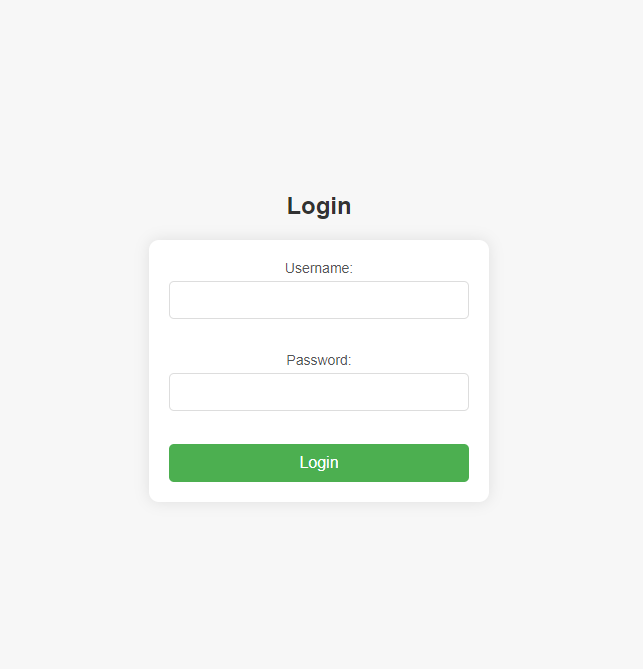
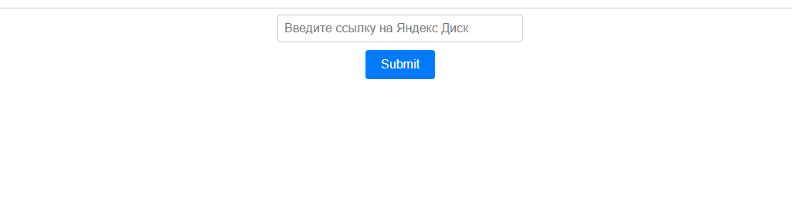
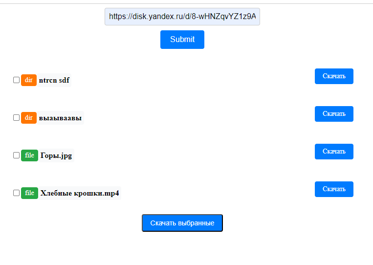

# mycego_test
Веб-приложение на Flask, которое взаимодействует с Яндекс API Диск.

## О проекте

Версия Python, используемая в проекте: 3.11

Приложение представляет собой одну страницу с полем для ввода ссылки на 
публичный ресурс Яндекс Диск.

В приложении реализовано кэширование данных, поэтому при повторном запросе ресурса в течение ближайших 60 секунд будет получен не актуальный, а кэшированный список.

### Установка


```bash
# Клонировать репозиторий
$ git clone git@github.com:SivikGosh/mycego_test.git

# Установить виртуальное окружение и список библиотек
$ py -3.11 -m venv venv
$ source venv/bin/activate
(venv)$ pip install -r requirements.txt

# Запустить приложение на тестовом сервере
(venv)$ python3 app.py
```

Приложение будет доступно по адресу http://localhost:5000

### Авторизация

Для входа на основную страницу нужна простая авторизация. Данные тестового пользователя:
- __Логин__: admin
- __Пароль__: admin

___страница авторизации___


После чего пользователь будет иметь доступ к основной странице приложения.

___страница приложения___


### Получение списка файлов и папок

Пример публичного каталога: https://disk.yandex.ru/d/8-wHNZqvYZ1z9A

После ввода и нажатия кнопки Submit пользователь увидит список файлов и папок, расположенных на запрошенном ресурсе:

___список элементов___


Которые можно скачать отдельно по прикреплённой кнопке к каждому элементу, либо отметив нужные эементы (чекбоксы слева), и нажав кнопку Скачать выбранные.

Запрошенные объекты будут загружены в папку загрузок, назначенную по умолчанию пользователем.
